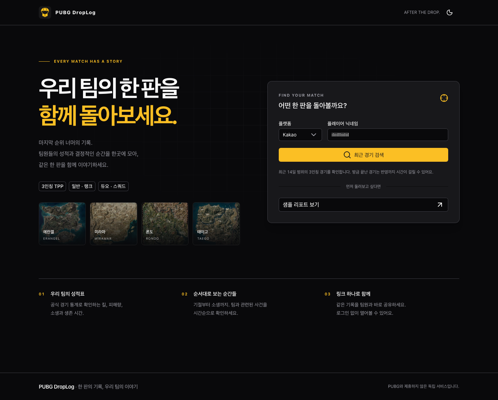
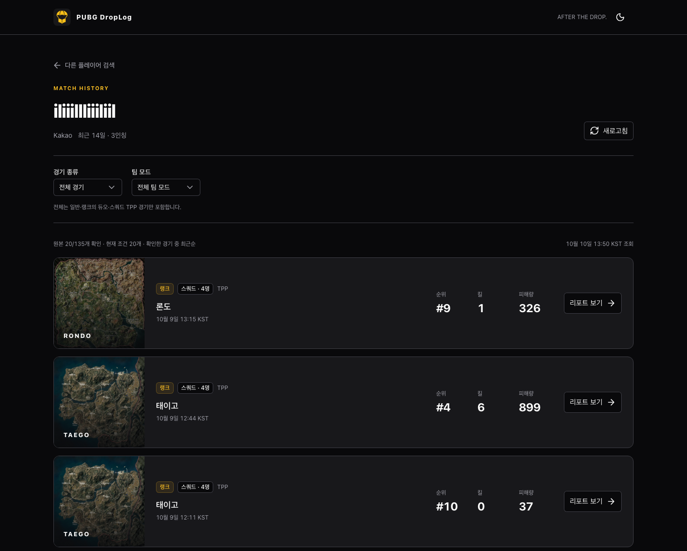
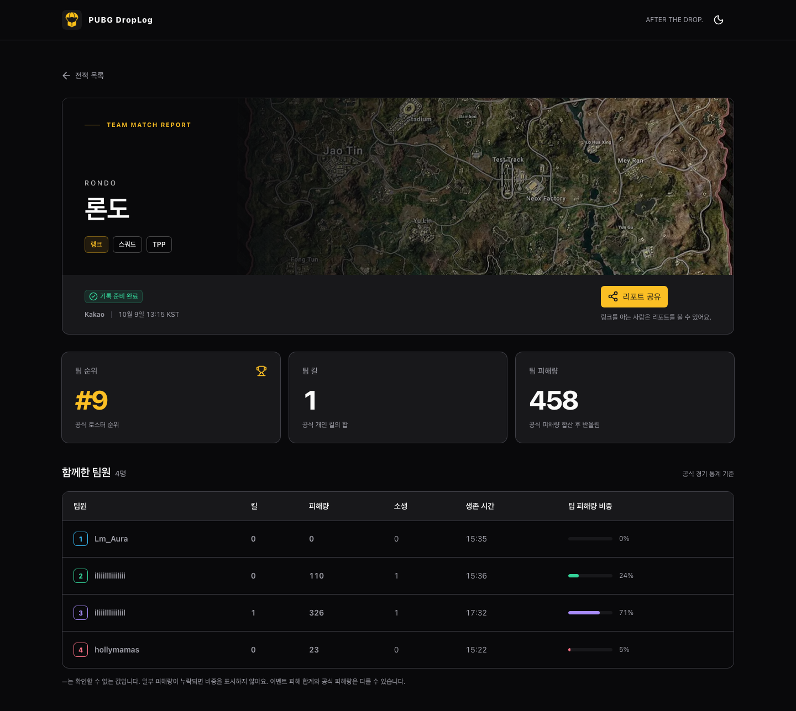
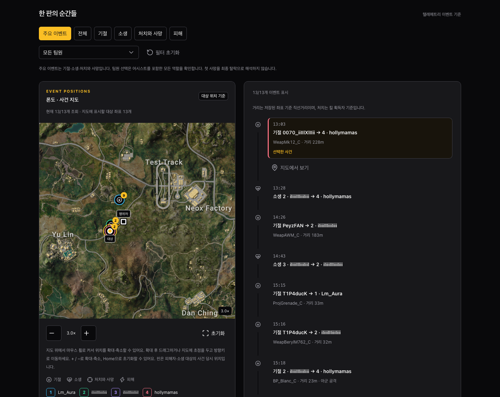
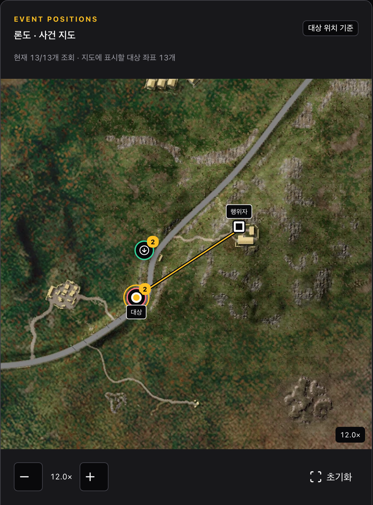

# DropLog

PUBG 팀의 한 판을 함께 돌아보는 한국어 웹 서비스입니다. Steam/Kakao 닉네임으로 **TPP 일반·랭크 × 듀오·스쿼드** 경기를 찾아 공식 팀 성적표, 사건 타임라인과 지도를 공유합니다.

Nuxt 4 + Nitro Node 서버, Nuxt UI 4 + Tailwind CSS 4, 서버 전용 pubg-kit을 사용합니다. 기본 저장소는 서버 메모리 캐시이며, 환경변수로 PostgreSQL + Drizzle ORM 영구 저장을 선택할 수 있습니다. 별도 API 서버·로그인·작업 큐는 없습니다.

## 주요 기능

- **경기 검색:** 일반/랭크와 듀오/스쿼드 교차 필터, 추가 경기 조회.
- **팀 리포트:** 공식 통계 기반 성적표, 팀원·유형별 사건 타임라인, 부분 데이터 안내.
- **사건 지도:** 핀과 타임라인 선택 연동, 버튼·마우스 휠 확대와 드래그 이동, 겹친 사건 목록. 피해자·소생 대상 위치와 선택한 사건의 행위자를 구분합니다.
- **링크 공유:** 보관 중인 리포트를 같은 URL로 열람. 기본 메모리 모드에서는 캐시 만료·퇴출 또는 서버 재시작 시 링크가 만료됩니다. 분석 버전 1은 기존 URL을 보존하면서 위치가 포함된 버전 2 리포트를 열 수 있습니다.

에란겔·미라마·태이고·론도·사녹·비켄디·카라킨·데스턴·파라모·헤이븐의 지도 이미지와 사건 핀을 지원하며, 첫 확대 시 [공식 8192×8192 이미지](docs/map-assets.md)를 불러옵니다. 실제 좌표 검증은 에란겔 한 경기에서 수행했고, 론도는 저장된 실경기 한 건의 핀 표시를 확인했습니다. 론도의 지형·건물과 위치의 정밀 대응 및 다른 맵의 실경기 위치는 추가 확인이 필요합니다. 좌표가 없는 사건도 타임라인에 남습니다. 지도는 현재 필터에서 불러온 사건을 표시하며, 이동 경로와 재생 기능은 없습니다.

## 구현 화면

2026년 10월 10일, Kakao의 `iliiillliiiliil`를 실제 검색한 데스크톱 다크 모드 화면입니다. **메인 → 전적 → 리포트** 순서로, 전적 목록의 론도 랭크 스쿼드 경기를 선택해 팀 기록을 확인했습니다.

### 1. 메인 · 플레이어 검색

플랫폼과 닉네임을 입력해 최근 경기를 검색합니다. 서비스 소개와 지원 모드를 확인하고, 샘플 리포트로 먼저 둘러볼 수도 있습니다.



### 2. 전적 · 경기 선택

일반·랭크와 듀오·스쿼드 필터로 경기를 찾고, 맵·순위·킬·피해량을 확인합니다. 각 경기의 **리포트 보기**를 누르면 해당 팀의 기록으로 이동합니다.



### 3. 리포트 · 팀 성적과 사건 복기

**팀 성적표**에서는 경기 정보, 팀 순위·킬·피해량과 팀원별 소생·생존 시간·피해량 비중을 확인합니다. 같은 리포트는 링크로 공유할 수 있습니다.



**사건 지도와 타임라인**에서는 기절·소생·처치와 사망을 시간순으로 살펴봅니다. 사건을 선택하면 지도에 행위자와 대상 위치가 함께 표시되며, 지도 확대와 팀원·유형 필터로 원하는 순간을 자세히 볼 수 있습니다.



**사건 지도 확대 보기** — 같은 사건을 12배로 확대하고 행위자와 대상 위치를 중심에 놓은 화면입니다. 주변 지형과 두 위치를 잇는 연결선을 자세히 확인할 수 있습니다.



## 빠른 시작

필요 환경: Node 24 LTS ([.nvmrc](.nvmrc)), pnpm 9.15.9. 기본 실행에는 DB와 Docker가 필요하지 않습니다.

```sh
nvm install
nvm use
corepack enable
corepack prepare pnpm@9.15.9 --activate
pnpm install --frozen-lockfile
test -f .env || cp .env.example .env
pnpm dev --host 127.0.0.1 --port 3100
```

[로컬 홈](http://127.0.0.1:3100)을 엽니다. 새 `.env`는 `demo` + 메모리 모드이며 Steam 또는 Kakao에서 `SquadMate`를 검색하면 됩니다. 기존 `.env`는 덮어쓰지 않으므로 이미 live로 설정했다면 실제 닉네임을 사용하세요. `NUXT_DB_ENABLED`를 생략해도 메모리 모드가 적용됩니다.

| 목적                 | 설정과 사용 방법                                                                                                   |
| -------------------- | ------------------------------------------------------------------------------------------------------------------ |
| API 키 없이 둘러보기 | `NUXT_DATA_MODE=demo`. 메모리 캐시로 합성 닉네임 검색·리포트 생성 가능                                             |
| 실제 경기 조회       | `.env`에 `NUXT_DATA_MODE=live`와 비공개 `NUXT_PUBG_API_KEY` 설정 후 서버 재시작                                    |
| 리포트 영구 저장     | `NUXT_DB_ENABLED=true`와 `NUXT_DATABASE_URL` 설정 후 DB 마이그레이션. [설정 안내](docs/development.md#저장소-선택) |
| 바로 화면 확인       | [일반 스쿼드 샘플](http://127.0.0.1:3100/reports/demo-normal-squad). 다른 세 조합은 화면에서 선택                  |

모드·키·저장소 설정을 변경한 뒤에는 개발 서버를 완전히 종료하고 다시 실행하세요. 실행 환경에서 지정한 값이 `.env`보다 우선합니다. [live 전환과 상태 확인](docs/development.md#demo와-live-전환)에 상세 절차가 있습니다.

메모리 캐시는 플레이어 조회 5분, 경기 1시간, 리포트 24시간 동안 보관하며 용량 한도를 넘으면 먼저 퇴출될 수 있습니다. 서버 프로세스별로 분리되고 재시작하면 사라집니다. `NUXT_DB_ENABLED=false`이면 DB URL이 있어도 앱은 DB에 연결하거나 저장하지 않습니다.

`.env`는 Git에서 제외됩니다. [.env.example](.env.example)의 DB 자격 정보는 로컬 Compose용 예시이며 외부 환경에는 별도 값을 사용해야 합니다.

## 개발과 검증

```sh
pnpm format:check
pnpm lint
pnpm typecheck
pnpm test
pnpm build
```

코드 정렬은 `pnpm format`, ESLint 자동 수정은 `pnpm lint:fix`로 실행합니다. VS Code에서는 저장소의 권장 확장 프로그램을 설치하면 저장 시 정렬과 ESLint 자동 수정이 적용됩니다. [코드 스타일 안내](docs/development.md#코드-스타일)에 설정과 제외 대상을 정리했습니다.

DB 통합 테스트, **별도 demo 서버를 사용하는 브라우저 테스트**, 생산 빌드 API smoke, 실제 PUBG 검증은 [개발 안내](docs/development.md#검증)에 정리했습니다.

2026-10-04 사건 지도 구현까지 단위 145개·PostgreSQL 12개·Chromium 29개가 통과했습니다. 실제 PUBG 데이터는 카카오 랭크 스쿼드 5경기와 그중 에란겔 한 경기의 지도 좌표를 확인했습니다. 다른 조합·플랫폼과 공개 운영 환경은 별도 검증이 필요합니다. 상세 근거와 측정 범위는 [검증 기록](docs/validation.md)을 참고하세요.

## 문서

| 문서                             | 내용                                                     |
| -------------------------------- | -------------------------------------------------------- |
| [문서 목차](docs/README.md)      | 문서별 역할과 권장 읽기 순서                             |
| [개발 안내](docs/development.md) | 환경변수, 모드 전환, 테스트, Node 실행, 데이터·운영 제약 |
| [진행 상태](docs/progress.md)    | 완료 범위, 후속 변경, 남은 작업                          |
| [검증 기록](docs/validation.md)  | 자동 테스트·실데이터 검증과 미검증 범위                  |

리포트는 로그인 없이 UUID 링크로 공유합니다. 링크를 아는 사람은 보관 중인 리포트를 읽을 수 있으며 `noindex`는 접근 제어가 아닙니다. PostgreSQL에 저장한 리포트는 서버 재시작·데이터 모드 변경 후에도 출처와 URL을 유지합니다. live 오류를 샘플 성공으로 대체하지 않습니다.
